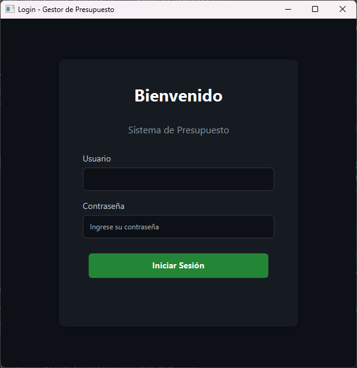

# Sistema de Gestión de Presupuesto Personal 💰

Una aplicación de escritorio robusta y moderna construida con **Java** y **JavaFX** para la gestión integral de finanzas personales. Permite a los usuarios rastrear ingresos, gastos, cuentas bancarias y presupuestos mensuales con una interfaz gráfica intuitiva.

## 🚀 Características Principales

### 📊 Dashboard y Saldos
- **Vista General:** Visualización rápida del saldo total en Bolívares (Bs) y su equivalente en Dólares ($).
- **Tarjetas de Cuentas:** Gestión de múltiples cuentas (Bancaria, Efectivo, Ahorro, etc.) con indicadores visuales de estado.
- **Alertas Visuales:** Las tarjetas cambian de color (Naranja/Rojo) si el saldo es bajo o negativo.

### 💸 Gestión de Transacciones
- **Registro:** Añadir ingresos y gastos con fecha, monto, descripción, cuenta y categoría.
- **Validaciones:** El sistema alerta si un gasto excede el saldo de la cuenta o el presupuesto de la categoría.
- **Historial:** Tabla de movimientos con filtros por fecha y cuenta específica.

### 📉 Presupuestos y Categorías
- **Categorías Personalizadas:** Creación de categorías con iconos (emojis) y límites de presupuesto mensual.
- **Control de Gastos:** Barras de progreso visuales que indican el porcentaje consumido del presupuesto por categoría (Verde/Naranja/Rojo).
- **Resumen Mensual:** Gráficos de pastel (PieCharts) para visualizar la distribución de ingresos y gastos. Navegación entre meses.

### 📅 Calendario y Pagos Recurrentes
- **Vista Calendario:** Visualización mensual de la actividad financiera.
- **Indicadores Diarios:** Puntos y barras de colores en los días con transacciones o pagos programados.
- **Pagos Recurrentes:** Configuración de transacciones automáticas (ej. Alquiler, Suscripciones) que se generan automáticamente al llegar el día configurado.
- **Interacción:** Al hacer clic en un día, se pueden ver los movimientos detallados o agregar un nuevo pago recurrente.

### ⚙️ Configuración y Persistencia
- **Tasa de Cambio:** Configuración manual del precio del Dólar para cálculos de patrimonio.
- **Persistencia de Datos:** Almacenamiento local mediante archivos de texto (`.txt`), lo que facilita la portabilidad y el respaldo sin necesidad de bases de datos complejas.
- **Gestión de Datos:** Opción para reiniciar el sistema (borrado de fábrica).

## 🛠️ Tecnologías Utilizadas

- **Lenguaje:** Java (JDK 17+)
- **GUI Framework:** JavaFX (FXML)
- **Persistencia:** Archivos planos (TXT) con parsing personalizado.

## 📂 Estructura del Proyecto

El proyecto sigue el patrón de diseño **MVC (Modelo-Vista-Controlador)**:

- **`model`**: Clases de datos (`Account`, `Transaccion`, `Gasto`, `Ingreso`, `Categoria`, `PagoRecurrente`).
- **`view`**: Archivos FXML (`main-view.fxml`, `add-transaction.fxml`, etc.) que definen la interfaz.
- **`controller`**: Lógica de la interfaz (`MainController`, `AddTransactionController`, etc.).
- **`service`**: Lógica de negocio (`GestorPresupuesto`).
- **`persistence`**: Manejo de archivos (`AlmacenDatosTxt`).

## 💾 Almacenamiento de Datos

Los datos se guardan automáticamente en la raíz del proyecto en los siguientes archivos:
- `cuentas.txt`
- `transacciones.txt`
- `categorias.txt`
- `recurrentes.txt`
- `config.txt`

## 🚀 Instalación y Ejecución

### Prerrequisitos
- Java Development Kit (JDK) 17 o superior.
- Maven o Gradle (dependiendo de tu gestor de dependencias).
- Un IDE compatible (IntelliJ IDEA recomendado).

### Pasos
1. **Clonar el repositorio o Descargar este Repositorio**

2. **Abrir en el IDE:**
    Importar el proyecto como proyecto Maven/Gradle.

3. **Configurar JavaFX:**
    Asegúrate de que las librerías de JavaFX estén configuradas en el module-path si no usas un gestor de dependencias que lo haga automáticamente.

4. **Ejecutar:**
    Busca la clase principal (PresupuestoApplication) y ejecútala.

## 📸 Capturas de Pantalla

[Pestaña Saldos](image.png)
[Pestaña Resumen](image-2.png)
[Pestaña Movimientos](image-3.png)
[Pestaña Calendario](image-4.png)
[Pestaña Más](image-5.png)

## 📄 Licencia

Este proyecto es de uso académico y puede ser utilizado libremente para fines educativos.  
Se permite su modificación y distribución siempre que se mantenga el crédito al autor original.

## Autor

**Estudiante:** Ender Moreno 
**Carrera:** Ingeniería en Informática  
**Universidad:** Universidad nacional Experimental De Guayana 
**Materia:** Técnicas de programación III
**Fecha:** 09 de Febrero de 2026
